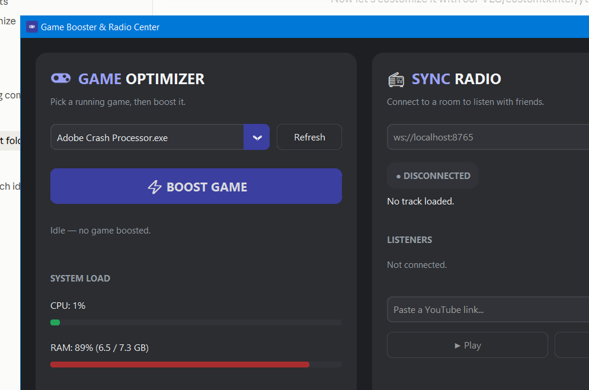

# Game Booster & Radio Center

A lightweight Windows desktop app for gamers: a one-click game optimizer that gives
your active game priority over background apps, paired with a synchronized radio so
you and your friends can listen to the same YouTube audio stream together while you
play — without touching video decoding or adding noticeable CPU/RAM overhead.

**[⬇ Download the latest release](https://github.com/ExiaD4166/game-booster-radio/releases/latest)**
— no Python or VLC install needed, just extract and run `GameBoosterRadio.exe`.



## What it does

**Game Optimizer**
- Pick any running process and boost it: raises its priority to `HIGH_PRIORITY_CLASS`
  and dedicates specific CPU cores to it.
- Every other background process on your PC gets lowered to `BELOW_NORMAL` priority
  and has its idle RAM trimmed, freeing up resources for your game.
- Keeps watching in the background and automatically catches new processes that
  launch *after* you hit Boost (a browser opening a new tab, for example).
- Crash-safe: if the app itself ever crashes mid-boost, it detects the leftover state
  on the next launch and automatically restores everything — you're never left with
  background apps permanently stuck at low priority.
- One click to restore everything back to normal.

**Sync Radio**
- Connect to a shared room (self-hosted or the included live server) and listen to
  the same YouTube track, in sync, with everyone else connected.
- One admin per room controls the shared playlist — play, pause, skip. Admins can
  promote other connected users to admin too.
- While an admin stream is live, everyone else's personal playback is automatically
  overridden and locked to the synced stream.
- No admin stream running? Any user can just play their own personal YouTube link
  locally, with zero effect on anyone else.
- A local Radio ON/OFF toggle and volume slider always work for everyone, regardless
  of role — muting your own speakers never affects other listeners.
- Client positions automatically self-correct if they drift more than 1.5 seconds
  from the shared server's position, so everyone stays close to in-sync even over a
  real internet connection.
- Audio-only streaming (`yt-dlp` + VLC) — no video is ever downloaded or rendered,
  keeping the CPU/GPU cost of the radio feature minimal while you're gaming.

## Tech stack

- **Python 3.11+**
- **CustomTkinter** — the desktop GUI
- **psutil** + Windows `ctypes` APIs — process priority/affinity control and RAM trimming
- **websockets** + `asyncio` — the real-time sync server and client
- **yt-dlp** + **python-vlc** — audio-only YouTube stream extraction and playback
- **Pillow** — custom-drawn icons and badges
- **PyInstaller** — packaging into a standalone Windows `.exe`

## Running from source

```bash
git clone <this-repo-url>
cd radio
python -m venv .venv
.venv\Scripts\activate
pip install -r requirements.txt
```

Start the sync server (needed for the radio feature; the game optimizer works with
no server running):

```bash
python server.py
```

In another terminal, start the app:

```bash
python app.py
```

By default the app connects to `ws://localhost:8765`. To connect to a different
server (including a friend's, or a deployed one), just type its address into the
"Server address" field in the app before clicking Connect.

## Running the packaged `.exe`

No Python installation needed — just run `GameBoosterRadio.exe` from the build
output. It bundles everything, including its own copy of VLC's audio engine.

### Building it yourself

Requires [VLC](https://www.videolan.org/vlc/) installed at its default location
(`C:\Program Files\VideoLAN\VLC`) on the machine doing the build — *not* on the
machine that will eventually run the `.exe`.

```bash
pip install -r requirements-build.txt
pyinstaller GameBoosterRadio.spec
```

The finished app appears in `dist/GameBoosterRadio/`.

## Deploying your own sync server

The included server is lightweight and designed to run on a free-tier host like
[Render](https://render.com):

- **Build command**: `pip install -r requirements-server.txt`
- **Start command**: `python server.py`

`server.py` reads its host and port from environment variables (`HOST`, `PORT`),
so the same code runs unchanged locally and on a hosting platform — no
configuration file to edit.

## Project structure

| File | Purpose |
|---|---|
| `app.py` | The desktop GUI — wires everything else together |
| `optimizer.py` | Game process priority/affinity/RAM optimization engine |
| `radio_player.py` | Audio-only YouTube extraction and VLC playback |
| `server.py` | WebSocket sync server (roles, shared playback state) |
| `sync_client.py` | WebSocket client used by the desktop app |
| `GameBoosterRadio.spec` | PyInstaller build configuration |
